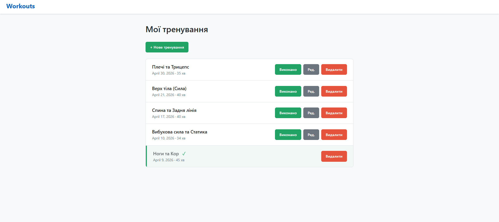
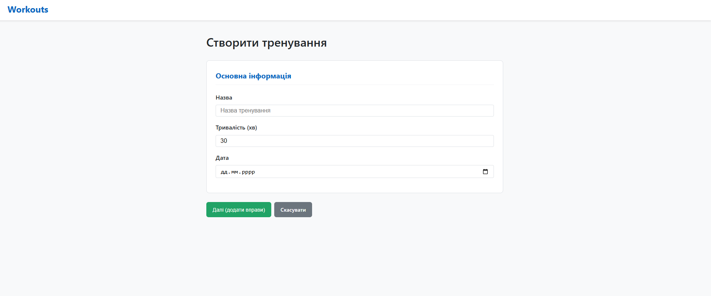
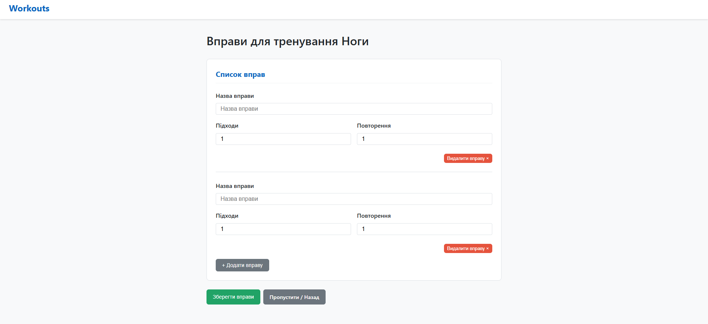
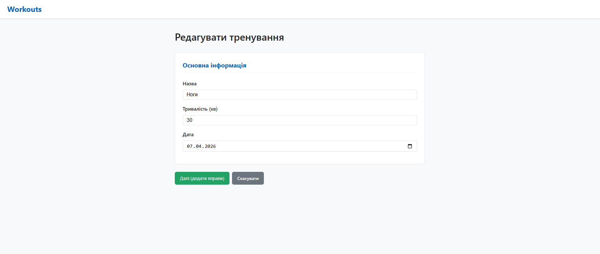
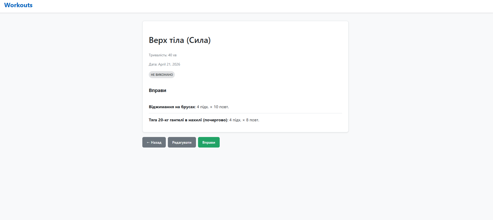

# Workouts Diary

Цей проєкт є зручним щоденником тренувань, побудованим на Django. Він дозволяє
створювати тренування, додавати до них список вправ з динамічним керуванням та
відстежувати прогрес виконання.

## Використані технології

Проєкт базується на наступних основних бібліотеках та сервісах:

- **Django 6.0.4** — основний фреймворк.
- **psycopg2-binary 2.9.11** — адаптер для роботи з PostgreSQL.
- **python-dotenv 1.2.2** — для керування змінними середовища.
- **Supabase (PostgreSQL)** — хмарна база даних (використовується **Transaction
  Pooler**).
- **JavaScript (Vanilla)** — для динамічного додавання та видалення вправ у
  формі без перезавантаження сторінки.

## Як запустити проєкт

### 1. Клонування репозиторію та підготовка

Переконайтеся, що у вас встановлено Python (рекомендовано 3.10+).

### 2. Створення віртуального середовища

```bash
python -m venv .venv
# Активуйте віртуальне середовище:
# Windows:
.venv\Scripts\activate
# Linux/macOS:
source .venv/bin/activate
```

### 3. Встановлення залежностей

```bash
pip install -r requirements.txt
```

> **Примітка для користувачів macOS:** На комп'ютерах з чипами Apple Silicon (
> M1/M2/M3) для коректного встановлення `psycopg2-binary` може знадобитися
> встановлений PostgreSQL у системі. Ви можете встановити його за допомогою
> Homebrew: `brew install postgresql`.

### 4. Налаштування середовища

Проєкт використовує змінні середовища через файл `.env`.

1. Скопіюйте приклад файлу налаштувань:
   ```bash
   # macOS / Linux / Windows PowerShell:
   cp .env.example .env

   # Windows Command Prompt (CMD):
   copy .env.example .env
   ```
2. Відкрийте файл `.env` та заповніть його власними даними (наприклад,
   параметри підключення до бази даних).

Обов'язкові змінні:

- `SECRET_KEY`: Секретний ключ Django.
- `DEBUG`: Режим розробки (`true` або `false`).
- `DB_NAME`, `DB_USER`, `DB_PASSWORD`, `DB_HOST`, `DB_PORT`: Налаштування бази
  даних PostgreSQL.
  > **Важливо:** Для роботи з **Supabase** рекомендується використовувати *
  *Transaction Pooler** (порт `6543`).
- `ALLOWED_HOSTS`: JSON-список дозволених хостів (наприклад,
  `["127.0.0.1", "localhost"]`).

Приклад налаштувань (для **Supabase Transaction Pooler**):

```env
SECRET_KEY=your_key
DEBUG=true
ALLOWED_HOSTS=[]

DB_NAME=postgres
DB_USER=postgres.xxxxxxxxxxxxxxxxxxxx
DB_PASSWORD=your_password
DB_HOST=aws-0-eu-central-1.pooler.supabase.com
DB_PORT=6543
```

---

### Відновлення даних (імпорт з JSON)

Якщо у вас є файл `backup.json`, ви можете завантажити дані з нього назад у
базу:

```bash
python manage.py loaddata backup.json
```

### 5. Застосування міграцій

```bash
python manage.py migrate
```

### 6. Запуск сервера розробки

```bash
python manage.py runserver
```

Тепер проєкт доступний за адресою `http://127.0.0.1:8000/workouts/`.

---

## Опис моделей

Проєкт складається з наступних моделей у додатку `workouts`:

### 1. Workout (Тренування)

Основна модель тренування.

- `title` (CharField): Назва тренування.
- `duration_min` (IntegerField): Тривалість у хвилинах.
- `completed` (BooleanField): Статус виконання.
- `date` (DateField): Дата проведення.

### 2. Exercise (Вправа)

Модель вправи, що належить до конкретного тренування.

- `workout` (ForeignKey): Зв'язок з моделлю `Workout`.
- `name` (CharField): Назва вправи.
- `sets` (IntegerField): Кількість підходів.
- `repetitions` (IntegerField): Кількість повторень.

## Особливості інтерфейсу

- **Динамічні форми**: Додавання нових вправ до тренування відбувається миттєво
  за допомогою JS кнопки "+ Додати вправу".
- **Статус виконання**: Виконані тренування візуально виділяються (зелений фон,
  галочка) і блокуються для редагування.
- **Сортування**: Тренування автоматично сортуються від найновіших до
  найстаріших за датою.
- **Чистий дизайн**: Сучасний інтерфейс без зайвих ефектів, адаптований для
  зручного використання.

## Скріншоти

### Список тренувань



### Створення тренування



### Додавання вправ



### Редагування тренування



### Деталі тренування


